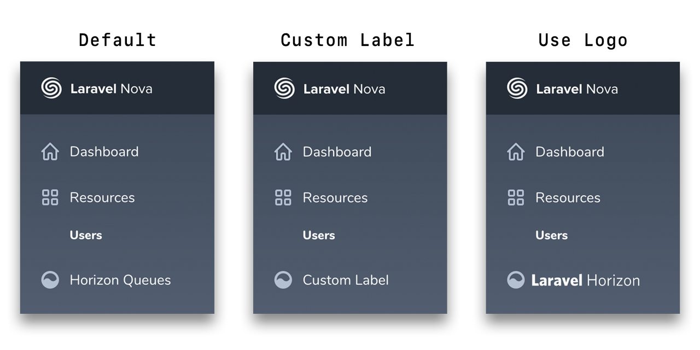

<p align="center">
    
</p>
<p align="center">Smart Link to <strong>Laravel Horizon Dashboard</strong> from <strong>Laravel Nova</strong></p>
<p align="center">
    <a href="https://packagist.org/packages/mad-web/nova-horizon-link"></a>
    <a href="https://styleci.io/repos/154735438"></a>
    <a href="https://packagist.org/packages/mad-web/nova-horizon-link"></a>
    <a href="LICENSE.md"></a>
</p>

## Laravel Nova Horizon Smart Link

Ability to add link to the [Laravel Horizon](https://horizon.laravel.com/)
Dashboard in the [Laravel Nova](https://nova.laravel.com/) sidebar. Link automatically disables if current user hasn't access to the _Horizon Dashboard_ according
with access policy which is defined in `Horizon::auth` method. For more information, checkout the [documentation](https://laravel.com/docs/master/horizon#dashboard-authentication).

## Demo

<p align="center">
    
</p>

## Installation

At first, install via composer:

```bash
composer require mad-web/nova-horizon-link
```

Next up, register the link in the `tools` method of the `NovaServiceProvider`:

```php
// app/Providers/NovaServiceProvider.php

// ...

public function tools()
{
    return [
        // ...
        new \MadWeb\NovaHorizonLink\HorizonLink,
    ];
}
```

## Customization

By default, link label is - **Horizon Queues**, if you prefer to customize it, just pass new label text into constructor:

```php
// app/Providers/NovaServiceProvider.php

// ...

public function tools()
{
    return [
        // ...
        new \MadWeb\NovaHorizonLink\HorizonLink('Custom Label'),
    ];
}
```

In addition, you may use _Horizon_ logo, just pass `null` or call `useLogo` method to provide more readable view:

```php
// app/Providers/NovaServiceProvider.php

// ...

public function tools()
{
    return [
        // ...

        new \MadWeb\NovaHorizonLink\HorizonLink(null),
        // or
        \MadWeb\NovaHorizonLink\HorizonLink::useLogo(),
    ];
}
```

## Contributing

Please see [CONTRIBUTING](CONTRIBUTING.md) and [CONDUCT](CONDUCT.md) for details.

## Security

If you discover any security related issues, please email [madweb.dev@gmail.com](mailto:madweb.dev@gmail.com) instead of using the issue tracker.

## Credits

- [Mad Web](https://github.com/mad-web)
- [All Contributors](../../contributors)

## License

The MIT License (MIT). Please see [License File](LICENSE.md) for more information.